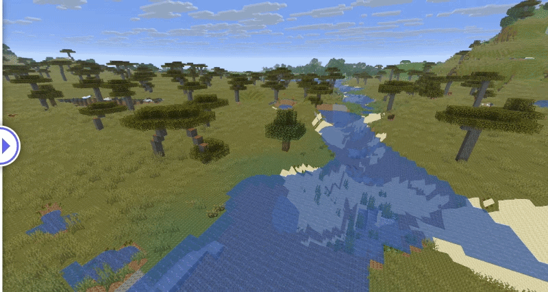
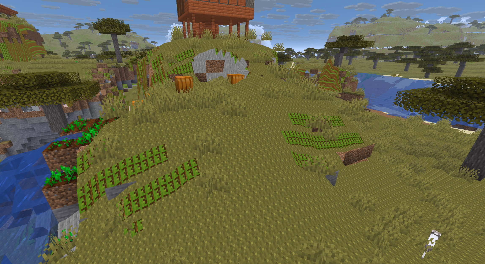
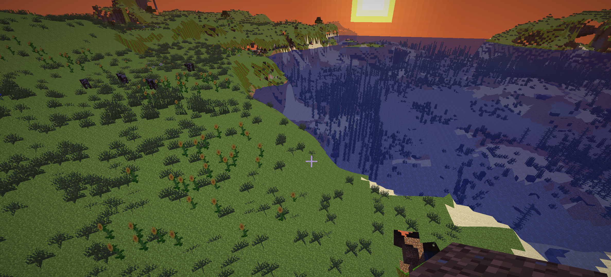

# Realistic MC

A Minecraft Fabric mod that replaces blocky terrain with smooth, bilateral-filtered surfaces for natural terrain blocks.  
Textures are currently broken.

## Features

- **Smooth Terrain Rendering**: Natural terrain blocks (grass, dirt, sand, stone, etc.) are rendered as smooth, organic surfaces instead of sharp cubes
- **Bilateral Filtering**: Advanced smoothing algorithm that preserves edges and cliffs while smoothing gentle terrain
- **Texture Mapping**: Smooth surfaces use the correct block textures based on the underlying block material
- **Material Groups**: Different terrain types (dirt, sand, snow, stone) are smoothed independently to preserve material boundaries
- **Performance Optimized**: Mesh generation happens during chunk compilation, with runtime safety checks to prevent crashes during world load

## Screenshots

### Before and After Comparison



### In-Game Screenshots





## How It Works

### Technical Overview

The mod uses a bilateral filtering algorithm to smooth terrain heights while preserving important features:

1. **Surface Detection**: Identifies exposed terrain blocks (grass, dirt, sand, stone, etc.)
2. **Height Sampling**: Samples terrain heights in a 17x17 grid with 2-block padding for boundary smoothing
3. **Bilateral Filtering**: Applies spatial and range-based Gaussian filtering to smooth heights while:
   - Preserving cliffs (height differences ≥ 4 blocks)
   - Respecting material group boundaries
   - Protecting local extrema (peaks and valleys)
4. **Mesh Generation**: Creates subdivided quad meshes (4x4 subdivisions per cell) for smooth geometry
5. **Texture Mapping**: Maps block textures to smooth surfaces based on face normals and underlying block state
6. **Chunk Integration**: Replaces vanilla block rendering with smooth terrain quads during chunk compilation

### Supported Blocks

The following natural terrain blocks are smoothed:

- **Soil Group**: Grass Block, Dirt, Coarse Dirt, Podzol, Mycelium
- **Sand Group**: Sand, Red Sand, Gravel
- **Snow Group**: Snow Block, Powder Snow, Ice, Packed Ice, Blue Ice
- **Stone Group**: Stone, Granite, Diorite, Andesite, Deepslate

### Algorithm Details

**Bilateral Filter Parameters:**
- Spatial radius: 2 blocks
- Spatial sigma: 1.65
- Range sigma: 3.0
- Cliff threshold: 4.0 blocks

**Mesh Subdivision:**
- 4x4 subdivisions per terrain cell
- Smooth interpolation between height samples
- Proper face normal calculation for lighting

## Installation

1. Download the latest `realisticmc-1.0.0.jar` from the [releases](../../releases) page
2. Install [Fabric Loader](https://fabricmc.net/wiki/installation/)
3. Install [Fabric API](https://modrinth.com/mod/fabric-api?loader=fabric#download) (required)
4. Place both jar files in your `.minecraft/mods` folder
5. Launch Minecraft

## Configuration

The mod is enabled by default. To toggle smooth terrain:

**In-game Command:**
```
/smooth
```
This command toggles smooth terrain on/off and rebuilds all chunks to apply the change immediately.

**Code:**
Edit `RealisticMCClient.java`:
```java
public static boolean smoothTerrainEnabled = false;
```

## Compatibility

- **Minecraft Version**: 1.26.1
- **Loader**: Fabric
- **Dependencies**: Fabric API (lifecycle-events-v1)

## Known Limitations

- Smooth terrain only applies to natural terrain blocks (structures, buildings, and custom blocks render vanilla)
- No collision system integration (you still collide with the original block shapes)
- No chunk boundary seam handling (some visible seams may occur at chunk borders)
- Basic lighting only (no ambient occlusion on smooth terrain)
- No LOD (Level of Detail) system

## Development

### Building

```bash
./gradlew clean build
```

The built jar will be in `build/libs/realisticmc-1.0.0.jar`

### Project Structure

- `RealisticMCClient.java` - Main client entrypoint and runtime state management
- `SectionCompilerMixin.java` - Mixin into chunk compilation to replace terrain rendering
- `BilateralTerrainMesh.java` - Core bilateral filtering and mesh generation algorithm

## Credits

Developed by NovaDev404
